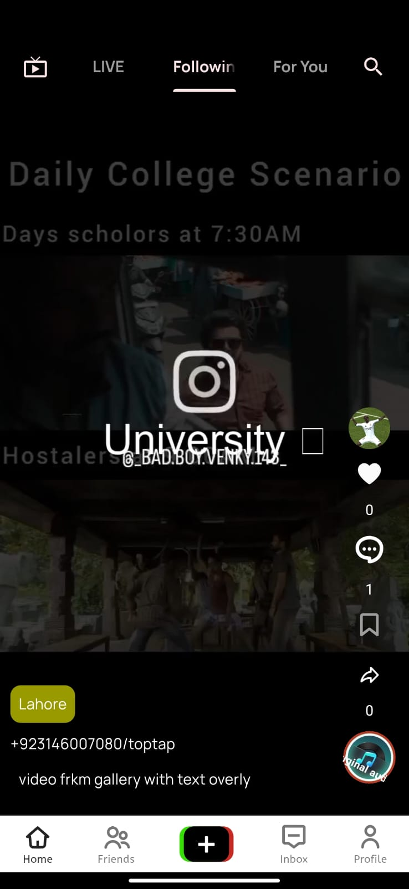
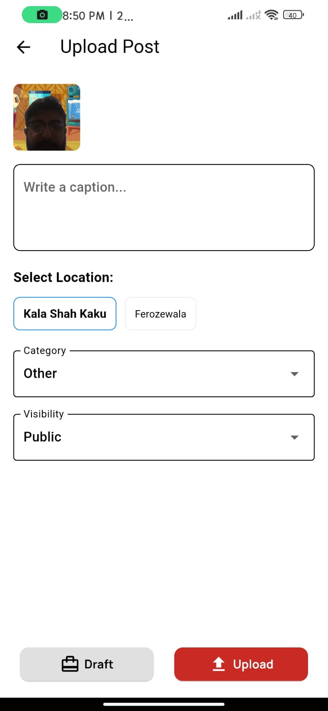
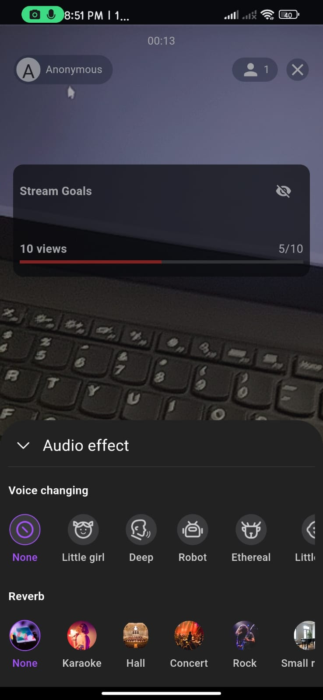
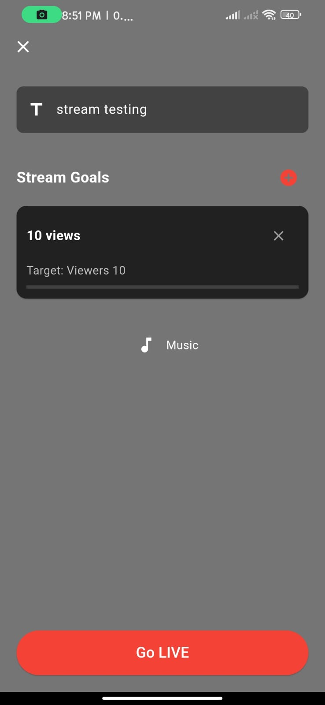
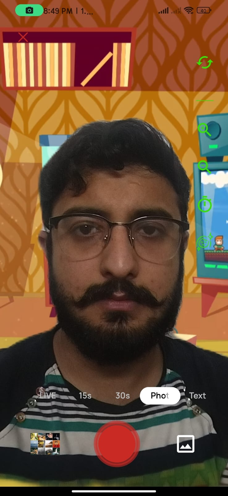
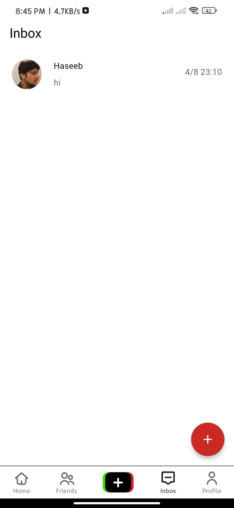
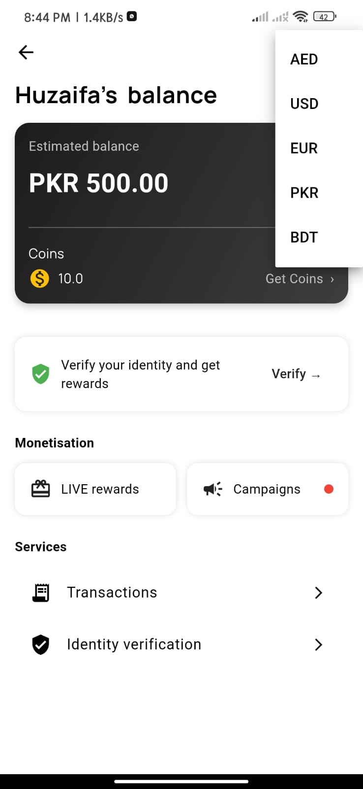
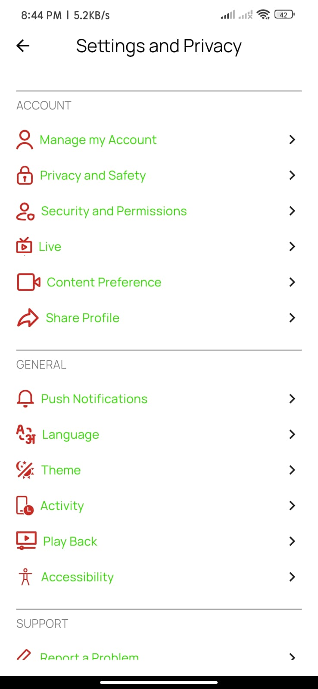

# 📱 Toptap – TikTok Clone App  

Toptap is a high-performance **Flutter-based TikTok clone** that allows users to create, share, and engage with short-form video content. Built with real-time **live streaming**, **face filters**, **chat with call**, and more!

---

## 🚀 Features  

### 👤 **User Profile**  
- TikTok-style profile with follower/following/post counts  
- Editable profile with bio and avatar  

### 🎥 **Video & Photo Upload**  
- Record or upload videos and photos  
- Add descriptions, hashtags, and post publicly or privately  

### 📡 **Live Streaming** *(ZegoCloud SDK)*  
- Go live instantly with low-latency streaming  
- Viewers can **join live streams**, comment, and send reactions  

### 🪄 **Face Filters** *(Banuba SDK)*  
- Real-time face tracking and beauty filters  
- Fun & interactive effects during video recording and live stream  

### ❤️ **Post Engagement**  
- Like, comment, and share videos  
- View post statistics in real time  

### 💬 **Chat & Call**  
- 1:1 real-time chat with emojis and image sharing  
- Voice and video call support inside the app  

---

## 🧰 Tech Stack  

### 🎯 Flutter & Dart  
- Cross-platform mobile development  
- State management via Riverpod or GetX (your choice)  

### 🔌 Integrations  
- **ZegoCloud SDK** – for live streaming  
- **Banuba SDK** – for camera filters and AR effects  
- **Firebase Firestore & Auth** – for user management and chat  
- **Cloud Storage** – for video and image uploads  
- **Socket.io** or **Zego IM** – for real-time chat/calls (as implemented)  

---

## 📸 Screenshots  

### 🏠 Home Feed  


### 🎬 Upload Post  


### 📡 Live Stream  
  


### 😎 Face Filter in Action  


### 💬 Chat and Call  


### 💰 Balance Page  


### ⚙️ Settings Page  
 

---

## 🚀 Getting Started  

```bash
git clone https://github.com/your-username/toptap.git
cd toptap
flutter pub get
flutter run
